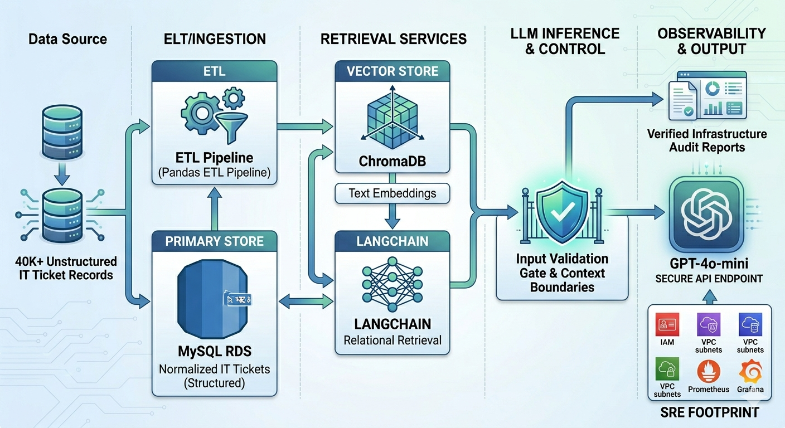

 # Enterprise IT Service RAG Model

An enterprise-grade **Retrieval-Augmented Generation (RAG)** pipeline designed to ingest, process, and audit massive technical incident data streams. The system automates corporate infrastructure audits by converting **40,000+ raw, unstructured tech-support records** into structured relational tables and semantic vectors, using strict context validation gates to eliminate Large Language Model (LLM) hallucinations.

---

## Business Problem & Core Objectives
Enterprise IT departments struggle to surface actionable insights from years of messy, high-volume ticketing logs. Manual technical audits are time-consuming, prone to oversight, and cost thousands of engineering hours. 

This project solves that bottleneck by providing:
1. **Automated Structured Ingestion:** Normalizing 40K+ messy technical support records into structured SQL entities.
2. **Context-Aware Analytics:** Using cutting-edge LLMs to instantly identify structural infrastructure vulnerabilities and recurring system incident trends.
3. **Rigorous Context Governance:** Enforcing definitive input/output validation boundaries to guarantee that automated audit decisions are derived *only* from verified organizational data.

---

## 🛠️ Tech Stack & System Architecture

* **Backend Orchestration:** `Python`, `LangChain`
* **Data Manipulation & Ingestion:** `Pandas`
* **Relational Storage:** `MySQL` (Structured operational data & incident fields)
* **Vector Embeddings Storage:** `ChromaDB` (High-dimensional semantic indices)
* **Language Model Intelligence:** OpenAI `GPT-4o-mini` API



```text
                           [ 40K+ Records ]
                                  │
                                  ▼ (Pandas ETL Pipeline)
                          [ MySQL Database ]
                         ╱                ╲
 (Relational Extraction)╱                  ╲ (Semantic Text Chunking)
                       ▼                    ▼
               [ LangChain ] ──────► [ ChromaDB Vector Store ]
                       │                    │
                       ├────────────────────┤
                       ▼                    ▼
            [ Input Validation Gate / Context Bounds ]
                       │
                       ▼
               [ OpenAI GPT-4o-mini ]
                       │
                       ▼
         [ Verified Audit Reports / Analytics ]


---

## 🌐 Web App: IT Ticket Explorer

A full-stack site for browsing the ticket dataset.

* **Backend:** `FastAPI` + `SQLite` (`backend/`). On first start it builds `backend/it_tickets.db` from the zipped CSV using `rag/rag.sql`.
* **Frontend:** `React` + `TypeScript` + `Vite` (`frontend/`). It provides category filters, full-text search, pagination and a ticket detail view.

### Run locally

```bash
To run the webstie first I did this, I will implement a backend api later
# Terminal 1: API on http://localhost:8000 (docs at /docs)
cd backend
python3 -m venv .venv && source .venv/bin/activate
pip install -r requirements.txt
uvicorn app.main:app --reload --port 8000

# Terminal 2: website on http://localhost:5173
cd frontend
npm install
npm run dev
```

### API

| Endpoint | Description |
| --- | --- |
| `GET /api/categories` | Ticket counts per category |
| `GET /api/tickets?q=&category=&limit=&offset=` | Search and filter tickets (paginated) |
| `GET /api/tickets/{id}` | A single ticket |
