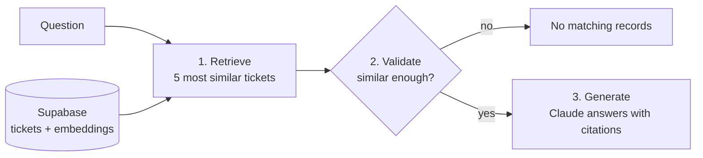

# Enterprise IT Service RAG Model

## Website_url: https://rag-model-harikrishna-maddineni.onrender.com

Ask questions about **47,837 real IT support tickets** in plain English. The app finds the most relevant tickets, ignores weak matches, and has Claude write an answer that cites the exact tickets it used.

> "Which storage problems come up repeatedly?" → an answer with links to tickets #17424, #14233, …

## How it works



**Retrieve → Validate → Generate.** If no ticket is similar enough, Claude is never called, so it can't make an answer up.

## Tech stack

| Part | Technology |
| --- | --- |
| Frontend | React, TypeScript, Vite |
| Backend | Python, FastAPI |
| Database | Supabase (Postgres) with pgvector for similarity search |
| Embeddings | all-MiniLM-L6-v2, run locally (free) |
| LLM | Claude (Anthropic API) |

## Project structure

```text
├── data/
│   ├── it_support_tickets.csv.zip   The ticket dataset
│   └── schema.sql                   The database table
├── backend/app/
│   ├── api.py         Web server and endpoints
│   ├── rag.py         Retrieve → Validate → Generate
│   ├── database.py    All Supabase queries
│   ├── ingest.py      One-time load: CSV → Supabase
│   └── config.py      Settings
├── frontend/src/
│   ├── App.tsx         Page layout, header and navigation
│   ├── HomePage.tsx    Landing page with links to Ask and Browse
│   ├── AskPage.tsx     Chat: question → answer + sources
│   ├── BrowsePage.tsx  Search and filter tickets
│   ├── TicketModal.tsx Full-ticket popup
│   └── api.ts          Calls to the backend
└── README.md
```

## What happens when you ask a question

1. `AskPage.tsx` sends the question to `POST /api/ask`. `api.py` checks it's 3–500 characters.
2. **Retrieve** (`rag.py`): the question becomes an embedding (384 numbers that capture its meaning), and Supabase returns the 5 closest tickets:
   ```sql
   SELECT ..., 1 - (embedding <=> question) AS score
   FROM support_tickets ORDER BY embedding <=> question LIMIT 5
   ```
3. **Validate**: tickets scoring below 0.3 similarity are dropped. If none are left, the app asks the user for a question that relates to the tickets, without calling Claude.
4. **Generate**: Claude gets the remaining tickets with instructions to use only them and cite their IDs. The website shows the answer, and each cited ticket can be opened.

## Design decisions

- **One database (Supabase + pgvector).** Ticket data and embeddings live in the same table. Browse uses normal SQL (filter, count, paginate) and Ask uses vector search, with no second database to keep in sync. An earlier version used SQLite plus ChromaDB.
- **Local embeddings.** Free, private and no API key needed. The same model embeds both tickets and questions, so their numbers are comparable.
- **Relevance threshold (0.3).** Even an off-topic question has *some* nearest tickets; the threshold stops those from reaching Claude. In testing, real questions scored 0.45–0.7.
- **Cited sources.** Every claim links to a ticket you can check.
- **One server.** FastAPI serves both the API and the built website.

## Limitations and next steps

- Broad questions ("what's most common?") only see 5 tickets; counting-style questions would need SQL aggregation instead.
- The threshold and top-5 were tuned by hand. A small labeled test set would tune them properly.
- Keyword search uses `ILIKE`, which doesn't rank results; Postgres full-text search would.
- No automated tests yet.


